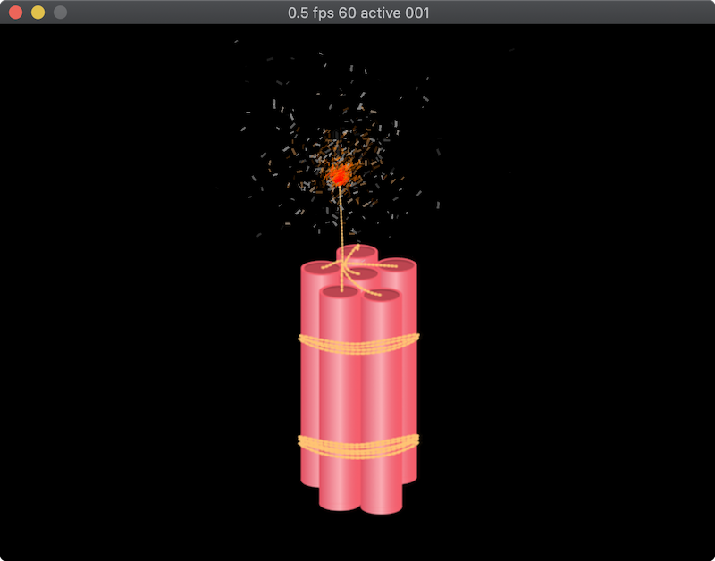

# LOVHOT-LÖVE

Hot Swap System for Love2d.

v0.5

Copy lovhot.lua to the project folder

Import module.

``` lua
local Hot = require('lovhot')
```

# Warning

Use same structure for your project as provided in example dir



``` lua
io.stdout:setvbuf('no')

local Hot = require('lib/lovhot')

function love.load()
    love.window.setPosition(0,0)
    -- create root.lua as entry point for hot reload and for all game logic
    -- after root.lua provide excluded files except main.lua and conf.lua (opt)
    Hot.load('game/root.lua')
end

function love.update(dt)
    -- fix temporary bug with cloned title in root.lua
    love.window.setTitle('')

end
function love.draw()
end
```


